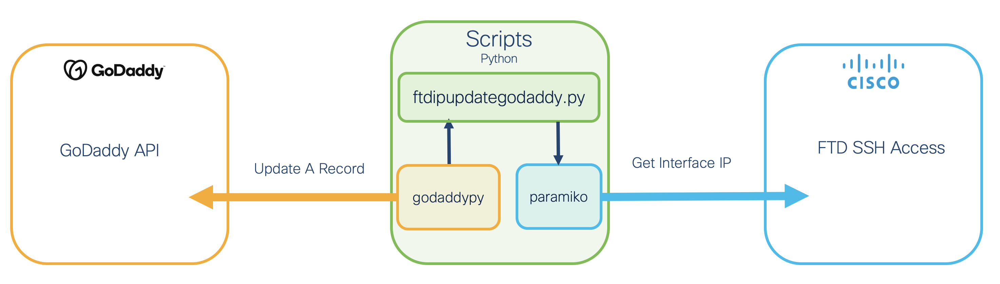
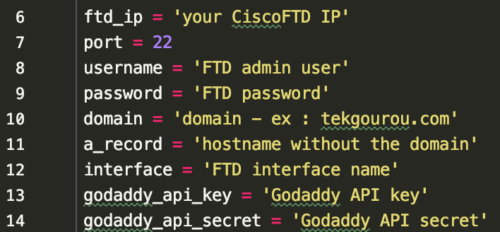

### This tool let let you automatically update your FTD wan public IP to your A record for a domain registered on Godaddy

This repo contains a Python script to grab the IP from a FTD interface and share it with Godaddy to update a A record.

 

Please contact me at alexandre@argeris.net, if you have any questions or remarks. If you find any bugs, please report them to me, and I will correct them.

### VARIABLES TO MODIFY BEFORE RUNNING THE SCRIPT
Theses variables in the main python script need to be modify before running the tool.  

### How to create a GoDaddy API key
https://developer.godaddy.com/getstarted

### CLONING THE REPO
git clone https://github.com/tekgourou/FTDipUpdateGodaddy.git  
cd FTDipUpdateGodaddy  
python3 -m venv venv  
source venv/bin/activate  
pip3 install -r requirements.txt  

### Running this script
Before running the following command ensure that all prerequisites are met and run it in the script directory loaded.
To run the tool simply execute:  
python3.6 ftdipupdategodaddy.py  

My suggestion is to run the script with crontab (linux) or Task Scheduler (Microsoft) every 60 minutes.  